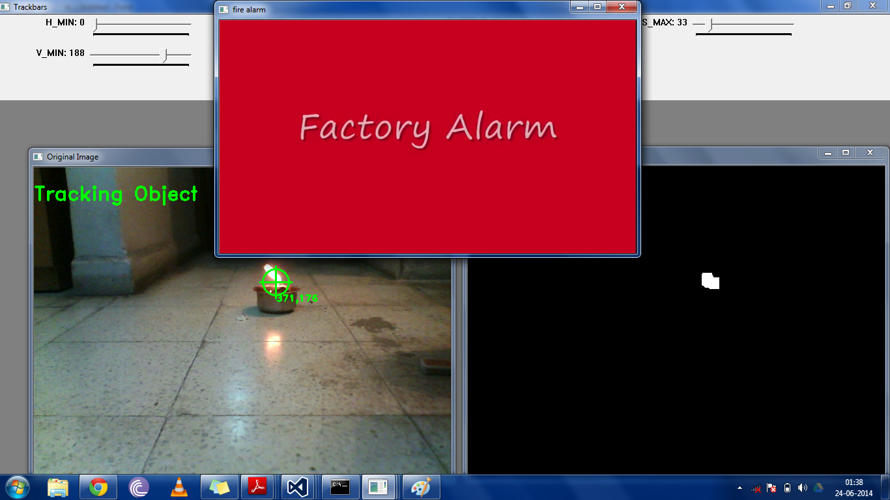

Fire detection application:

DualModelled and DualModelled2 contain two variants of the main code which identifies the fire-like characterstics in the captured video stream.

FeatureExtractor contains a trial extractor which is to be used for SVM

GMM contains an Expectation Maximization implementation using GMM for detecting motion of the segmented (fire-like) areas

Finally, SVM and SVMTrial implement a support vector machine on a static picture for trial. This isn't extended to the video stream.

